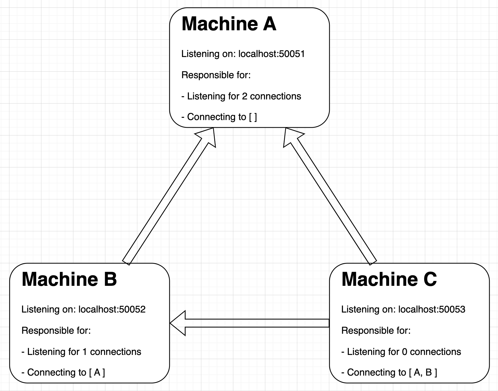
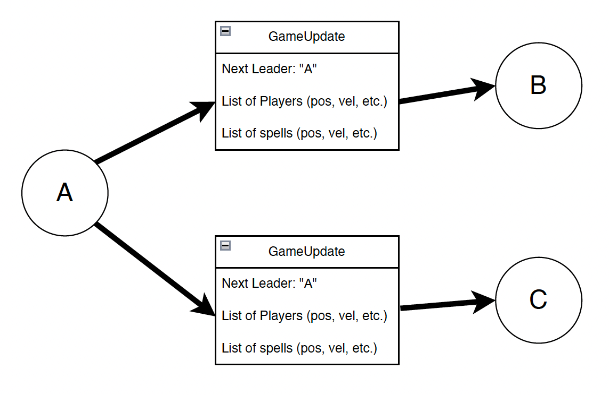
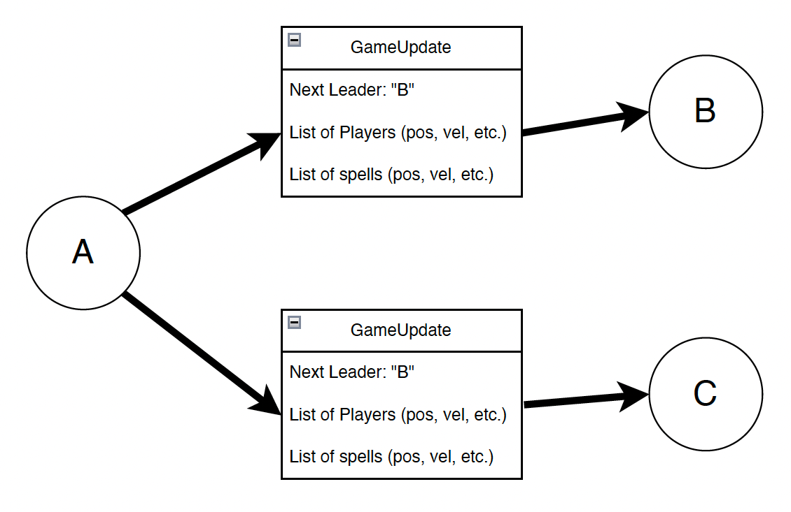
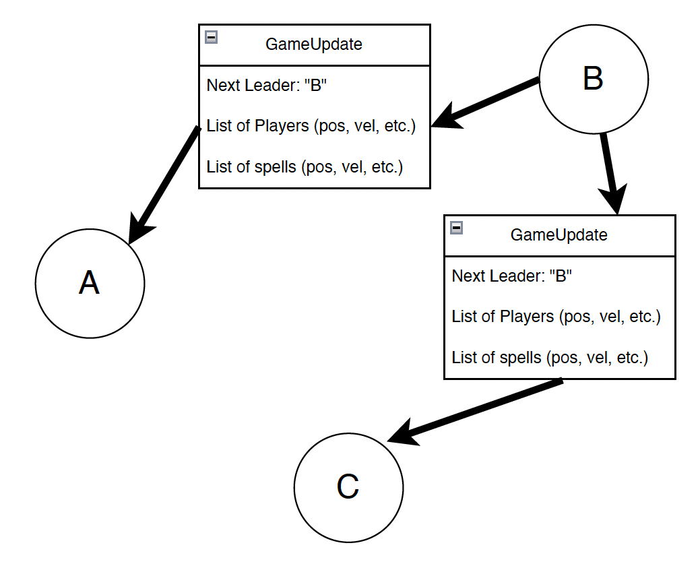

# Architecture

This document outlines the high level structure of our system.

## Table of Contents

1. [Coordinating the Game](#coordinating-the-game)
2. [Playing the Game](#playing-the-game)
3. [Leader Switches](#leader-switches)

## Coordinating the Game

We wanted to make our game be able to support a dynamic number of players. To do this we implemented a negotiator service in `negotiator.py`. Essentially, it will have a known IP/port combination and exist solely to listen for new players.

When a new player wishes to join the game, they reach out to the `negotiator` and receive a response. If they provided a unique name and there is still space in the game, the response is `True`. Otherwise it is `False` and the player must try again.

### Setting Up Connections

A big benefit of having a central `negotiator` is that we can determine an efficient way to have the players establish communication. When the `negotiator` decides to start the game (all players have connected) it will reach out to each player with a list of other players they are responsible for `connect`ing to. (NOTE: All players are always listening for incoming connections on a port prescribed by the `negotiator`.)

The above figure shows an example of how the negotiator might dictate configurations to get a complete topology in as few connections as possible.

Once each machine connects, they setup four sockets:

- One for sending/receiving game states
- One for sending/receiving input
- One for health checks
- One for broadcasting communication records to the watcher

### Who Gets to be the First Leader?

Our negotiator makes this easy. The first leader is recognized as the first person to join the game.

## Playing the Game

Updates happen 30 times a second. Only one machine is performing authoritative updates at a time, but the rest of the players calculate approximate updates by assuming that everying will always travel in a straight line.

Inputs are broadcast to all players immediately as soon as they happen. To avoid congestion, we limit the player to broadcast at most one set of updates per frame (since this is all that could hopefully be processed anyway).

When machines that are not the leader receive game updates over the wire, they forget their current state and update to the new state, being sure to start interpolating from this point forward to get more accurate guesses of where players and spells will be.

## Leader Switches

To understand our final switching protocol, it's important to understand the path we took to get here.

### Naive Switching

In the naive protocol, each gamestate update contains information about who the next leader will be. Each frame, as clients process these updates, they make sure they update their view of the leader and ignore any updates coming from non-leaders. This process is shown in more detail in the three frames below.

### Problems with the Naive Approach

The naive approach can easily lead us to deadlock. This is explained in the technical report.

### Introducing a Logical Clock to Leader Updates

To solve the problems of the naive approach, we attach a logical counter to all leader updates and instead of listening for the next leader from the current leader, we allow other machines to take leadership if they have a higher value in the counter.

### Higher Efficiency

This left us with a protocol whereby the leader would identify they no longer should be the leader, send an update, and then stop doing anything. This means for followers they would have to wait for the old leaders communication to get to the new leader, AND THEN wait for the new leader's update to reach them. In practice this is noticeably slow.

To fix this we introduced a short window wherein both the old leader and the new leader would be sending state updates, and followers (if they receive both at conflicting times) would decide who to listen to by using the logical counter.
